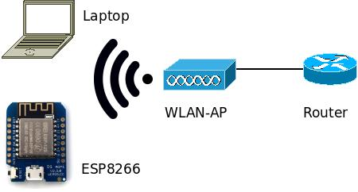

# About
Following can be found here:

- How to setup IPv6 with ESP8266 without changing the FreeRTOS-SDK. [esp-client](esp-client)
- A small example program to verify the IPv6 connection. [esp-ipv6-listener](esp-ipv6-listener)
- How to setup an IPv6 environment with a Cisco Router.

## Table of Contents

- [Test Construction](#test-construction)
- [Check of the API](#check-of-the-api)
- [Comision](#commision)
	- [Setting up the IPv6 environment](#setting-up-the-ipv6-environment)
	- [Using socket-API of the LWIP](#using-socket-api-of-the-lwip)
	- [Configuration via ICMPv6](#configuration-via-icmpv6)
- [Monitoring and Validation](#monitoring-and-validation)
- [Result](#result)

# Test Construction
The goal of the test construction is to observe every package in a minimal environment. 
So we can see how the ESP reacts and handle with IPv6.

This is how the setup looks like:



On the right side is a Cisco Router. It is set to process only IPv6 packages. 
This is important so that the esp does not have to handle an IPv4 and IPv6 connection.

In the middle is a very simple wireless accesspoint. 
It is significant that the AP don't change any packages. This would be another source of error.

On the left side is the ESP itself and a laptop. The laptop runs wireshark to record the packages 
between the ESP and the router. Additionally, it connects to the ESP and checks for correctly working TCP/UDP connection. 

# Check of the API

Espressif provides a FreeRTOS-SDK which includes the LWIP and custom TCP/UDP-API. 
Initially it was to attempted to use the API provided by espressif, 
which can be found in the espconn.h header. 

After investigating the API it was apparently not possible to actually use IPv6 addresses or any 
functionality related to IPv6 with the provided espconn.h header. 
To verify this assumption, different SDK configuration, official documentation and source code were checked.

A quick grep of source code verified the assumption. 
The structure `struct espconn` is central for dealing with TCP/UDP connections, 
but it does not allow setting a IPv6 address, only an address with a width of 32 bits is supported. 
The structure for TCP is shown below.

```c
typedef struct _esp_tcp {
    int remote_port;
    int local_port;
    uint8 local_ip[4];
    uint8 remote_ip[4];
    espconn_connect_callback connect_callback;
    espconn_reconnect_callback reconnect_callback;
    espconn_connect_callback disconnect_callback;
    espconn_connect_callback write_finish_fn;
} esp_tcp;
```


Which lead to the decision to use IPv6 via LWIP of the FreeRTOS-SDK, 
which should include IPv6 support by a [official statement](https://bbs.espressif.com/viewtopic.php?t=619). 
Following the link of the official statement no working example for IPv6 was found.

Again the source code was grepped for IMCPv6 functionality and support for IPv6 addresses.

IPv6 settings were toggled on in the settings header. As well IPv6 is supported by socket-API, 
which can be used with FreeRTOS. 


# Commision
The following describes a detailed setup steps and code examples to illustrate a working IPv6 
setup on the ESP8266. As well shows pitfalls and weird behaviour. 

## Setting up the IPv6 environment
A fully functional IPv6 environment was required to test the correct behaviour of the ESP8266. 
As described in the environment setup a cisco router was used with the [following configuration](http://www.ciscopress.com/articles/article.asp?p=31948&seqNum=4).

Setup the initial configuration by following the instructions of the cisco router manuel.

Afterwards configure the cisco router to use IPv6. Switch into the configuration mode. 

```
Router> enable
Router> configure terminal
```

Enable Unicast Routing

```
Router(config)# ipv6 unicast-routing
```

Select a interface to configure e.g. Cisco 1900 Series

```
Router(config)# interface GigabitEthernet 0/0
```
Set a global unicast address and enable ipv6

```
Router(config-if)# ipv6 enable
Router(config-if)# ipv6 address 2001:0410:0:1:0:0:0:1/64
```

Optionally set a site-local address, which is not required because a link-local and site-local 
address will be generated automatically.

```
Router(config-if)# ipv6 address FEC0:0:0:1::1/64
```

The settings can be verified by connecting to environment via the accces point. 

## Using socket-API of the LWIP
The socket API of the lwip can be used. Some setup code is shown below.


```c
struct ip6_addr target_ipv6_addr;
int socket_fd;
struct sockaddr_in6 sock_addr;
 
ip6addr_aton(TARGET_IPV6, &target_ipv6_addr);
socket_fd = socket(AF_INET6, SOCK_STREAM, 0);
 
sock_addr.sin6_family = AF_INET6;
 
struct in6_addr *ref_s6_addr = &sock_addr.sin6_addr;
struct ip6_addr *ref_target_ipv6_addr = &target_ipv6_addr;
inet6_addr_from_ip6addr(ref_s6_addr, ref_target_ipv6_addr);
sock_addr.sin6_port = htons(8080);
 
 
// Start the connecting to a server
// ...
```

## Configuration via ICMPv6
After initially setup up of the router and connection the PC to the network, a valid IPv6 address was assigned. 
Afterwards the ESP8266 was configured to connect to the same network and the wireshark was checked for ICMPv6 communication.

The ESP8266 did not respond to any ICMPv6 messages, which lead to the conclusion that no link-local address was assigned.

On startup no link-local address will be automatically assigned and it is impossible to assign or 
configure a different behaviour with the SDK of espressif. 
The only solution is to set the link-local address via lwip, after the `user_init` call.

Weirdly it is not possible to assign a link-local address in the `user_init` function and the exact reason is unknown. It is possible to assign the link-local address within the wifi-callback-handler, after connection to the access point.


### Setting the link-local address on the ESP8266
```c
void manual_netif_setup() {
    // First find our network interface
    struct netif *interface = netif_find("en0"); 
 
    // Check if it is up and set it up
    bool is_interface_up = netif_is_up(interface);
 
    if (!is_interface_up) {
        netif_set_up(interface);
    }
 
    // Assign a linklocal address via the mac addresss
    netif_create_ip6_linklocal_address(interface, 0);
}
 
 
void wifi_event_cb(System_Event_t *event) {
    if (event == NULL) {
        os_printf("event is null\n");
        return;
    }
    os_printf("event id: %d\n", event->event_id);
 
    // Check the id of the event
    switch(event->event_id) {
        case EVENT_STAMODE_GOT_IP:
            os_printf("Got an ipv4 address");
            break;
        case EVENT_STAMODE_CONNECTED:
            os_printf("Connected to AP\n");
            // After connection to the access point manually set the address
            manual_netif_setup();
 
            // Start the user task
            user_task();
            break;
        default:
            os_printf("Did not receive an ip address\n");
            break;
    }
}
```


# Monitoring and Validation
After connection the PC to the Cisco Router via the access point, an IPv6 address was assigned. 
Afterwards the same behaviour needed to be observe with ESP8266.

In the case that IPv6 was properly programmed Router Solicitation and Neighbor Solicication traffic 
should happen automatically between the nodes, when a link-local address is assigned. 
After a successfull ICMPv6 configuration, a TCP/IPv6 connection can be established. 
With the current setup the Cisco Router should advertise its addresses and the ESP8266 should advertise and query for neighbours.

That behaviour was observed via [wireshark](wireshark-dumps).

To prove that the esp8266 can actually send a packet via TCP/IPv6, a connection was established 
from ESP to a PC and a small "hello world" was packet send. The full source code and wireshark dump 
can be found in the github repository. 


# Result
The ESP8266 is capable to communicate via IPv6, but the documentation is lacking on how to actually set it up. 
After configuring a link local address with the MAC address, 
the ESP will start ICMPv6 communication to retrieve a valid address. 
This can be achieved by using the code of the `manual_netif_setup` function. 
No further modification of the lwip are necessary.

LWIP does not incoporate seamless with ESP8266 FreeRTOS-SDK, 
on some occasions a boot loop was entered and it was not apparent why or how it happened. 
